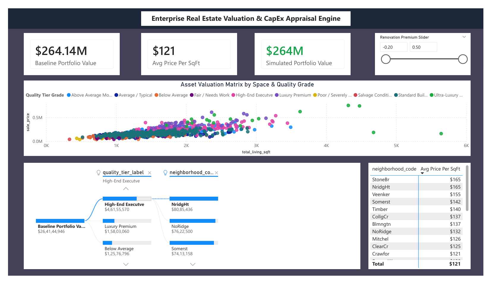
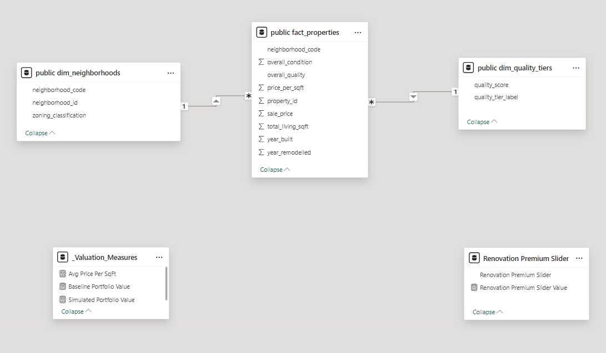

# Enterprise Real Estate Valuation & Investment Appraisal Engine

## 📊 Business Scenario
Asset valuation models in high-value retail, luxury commodities, and real estate often suffer from disjointed data silos and static pricing estimates. This end-to-end data analytics platform bridges that gap by replacing manual, traditional calculations with an automated, relational cloud-ready pipeline. 

By integrating multi-variable asset properties (neighborhood zoning, dimensions, and material quality grades), this system allows executives and investment appraisal directors to isolate valuation patterns and interactively simulate portfolio value fluctuations based on structural updates.

## 🛠️ Tech Stack & Pipeline Architecture
- **Data Engineering & Preprocessing:** Python (Built-in `csv` module) engineered inside VS Code to cleanly parse, impute missing geographic parameters, and feature-engineer pricing metrics natively without relying on heavy external data-frame libraries.
- **Relational Data Tier:** PostgreSQL server managing an enterprise-standard **Star Schema** architecture (Fact/Dimension configurations) with strict data integrity parameters.
- **Analytical Intelligence:** Power BI Desktop leveraging context-aware Data Analysis Expressions (DAX) and integrated numeric "What-If" parameter simulation engines.

---

## 📐 Data Architecture (Star Schema Design)
The application architecture breaks down a flat transactional stream into a high-performance analytical schema:

---

## 🚀 Analytical Execution (The STAR Framework)

### 1. Situation
Investment managers lacked centralized transparency into property values across fragmented regional zones, making it impossible to accurately forecast asset appreciation resulting from physical renovations.

### 2. Task
Build an end-to-end data pipeline to ingest messy property records, normalise the schemas into a structured relational server, and construct an interactive appraisal tool.

### 3. Action
* **Formulated Pure Python Extraction:** Crafted a library-free Python script utilizing native system libraries (`csv` module) to programmatically ingest transactional records, handle categorical data missing variables via statistical modes, and calculate pricing velocity.
* **Designed SQL ETL Staging Routine:** Developed a multi-tier dynamic staging table workflow inside a **PostgreSQL** server to bypass type-mismatch roadblocks, enforce primary/foreign keys, and cast fields smoothly.
* **Programmed Advanced DAX Intelligence:** Programmed cross-relational DAX metrics coupled with custom sliding thresholds to dynamically simulate capital expenditure adjustments.

### 4. Result
* **Executive Visibility:** Delivered a production-ready dashboard featuring a high-impact **Decomposition Tree** asset drill-down and a color-coded quality matrix heat map tracking a global **$264.14M portfolio baseline**.
* **Identified Systemic Bottlenecks:** The multi-variable scatter plot successfully isolated high-velocity valuation pricing curves, providing appraisers with immediate clarity on target market appreciation.
Step 2: Push Your Code to GitHubLog into your GitHub account and click the green New repository button.Name it Enterprise-Real-Estate-Valuation-Engine.Set the repository visibility to Public. Leave all initialisation checkboxes unchecked and click Create repository.Click the blue "upload an existing file" hyperlink link on the next page, and drag and drop your project files directly into the window:📄 data_cleaning.py (Your library-free Python script)📄 analytical_queries.sql (Your advanced SQL window function queries)📄 dax_measures.txt (Your DAX calculations catalogue)📄 README.md (Your documentation)📁 images/ (The folder housing your dashboard screenshot named dashboard.png)Click Commit changes to take your portfolio live!Part 2: Your LinkedIn Launch TemplateTo capture the attention of recruiters and hiring managers, post your clean screenshot on LinkedIn with this technical, high-impact caption:text🚀 Just finalized an end-to-end Enterprise Real Estate Valuation & CapEx Appraisal Engine platform! 

To stand out in a competitive data analytics market, I decided to bypass standard drag-and-drop shortcuts and build a high-performance data architecture that models asset attributes (zoning classifications, square footage dimensions, and material quality grades) to track valuation patterns and dynamically simulate market premiums.

Here is the professional engineering workflow I executed:
1️⃣ Native Data Engineering: Wrote a library-free Python script utilizing native system libraries (built-in CSV module) to programmatically ingest messy property records, impute missing geographic fields via statistical models, and feature-engineer unit velocity metrics.
2️⃣ Relational Database Design: Developed a production-grade Star Schema architecture inside a PostgreSQL database server, utilizing explicit DDL keys and writing advanced SQL window functions to rank asset pricing tiers.
3️⃣ Data Analytics & Modeling: Loaded the normalized server data into Power BI Desktop, mapping relational single-direction filter paths.
4️⃣ Simulation Engineering: Programmed context-aware DAX metrics tied directly to custom numerical What-If parameters, allowing investment directors to interactively simulate real-time portfolio appreciation based on capital expenditures.

📊 Key UI Highlights: Implemented an alert-driven executive interface featuring an advanced property Decomposition Tree for granular investment drill-downs, a geographic matrix pricing heat map, and a multi-variable scatter plot mapping luxury asset valuation curves.

Check out the full open-source code repository, native scripts, and database schema setups on my GitHub here: [INSERT YOUR GITHUB LINK HERE]

#PowerBI #DataAnalytics #DataEngineering #SQL #PostgreSQL #Python #RealEstateAnalytics #BusinessIntelligence
Use code with caution.What's Your Next Strategic Move?You now have two incredibly strong end-to-end portfolios (Supply Chain and Real Estate) live on your GitHub.If you are ready to prepare for your job applications, let me know:Would you like me to write a professional cover letter tailored for a fresher analyst role that weaves these two projects together?Or should we run through a technical mock interview to practice explaining your Python cleaning and SQL staging choices to a hiring manager?Let me know how you'd like to proceed to get your first data analyst job!
